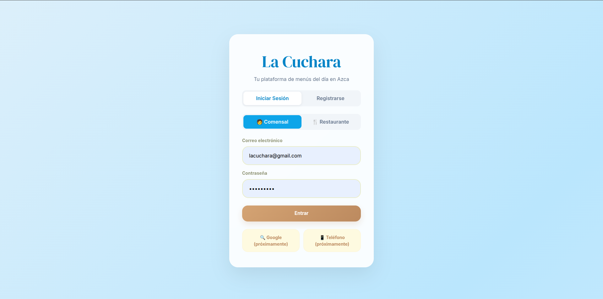
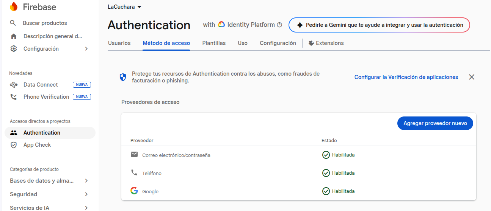
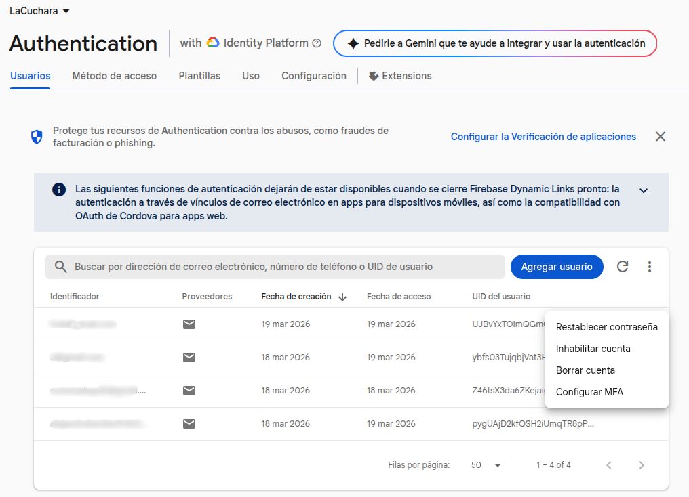
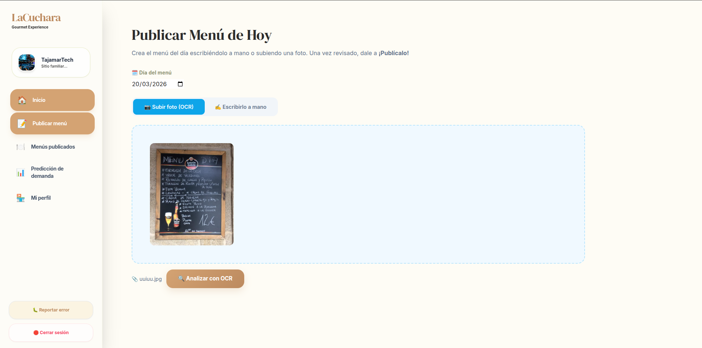
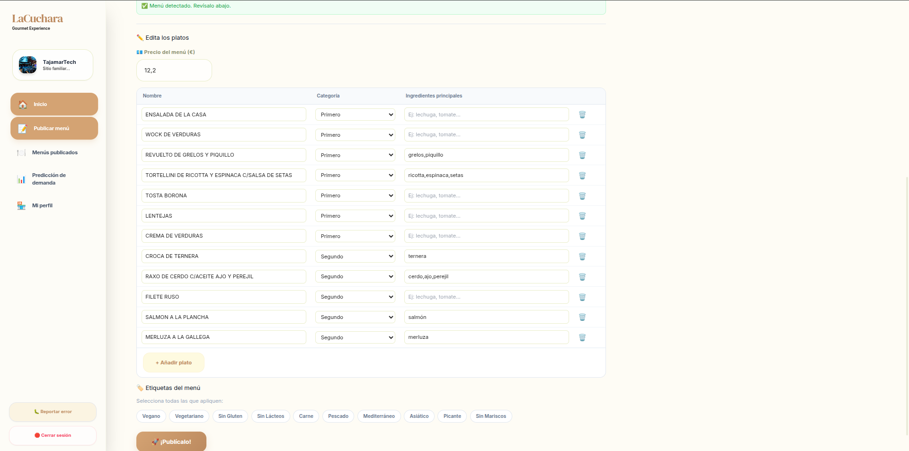
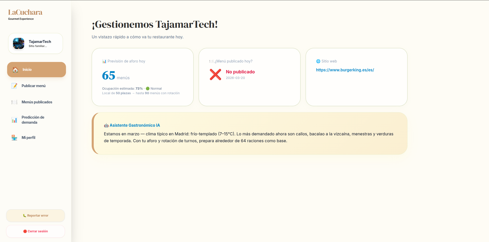
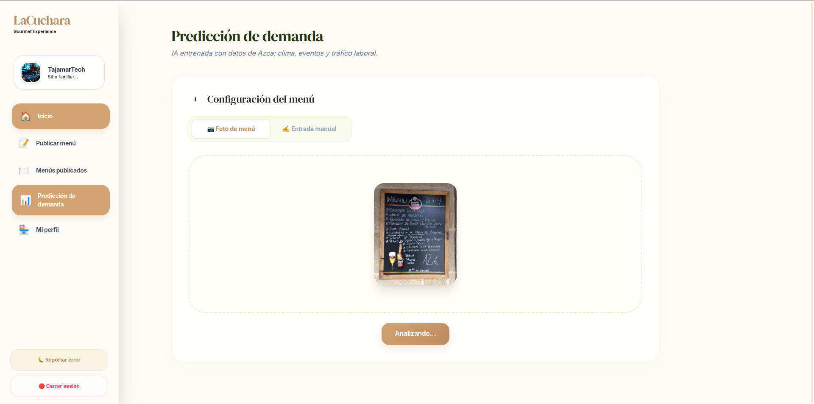
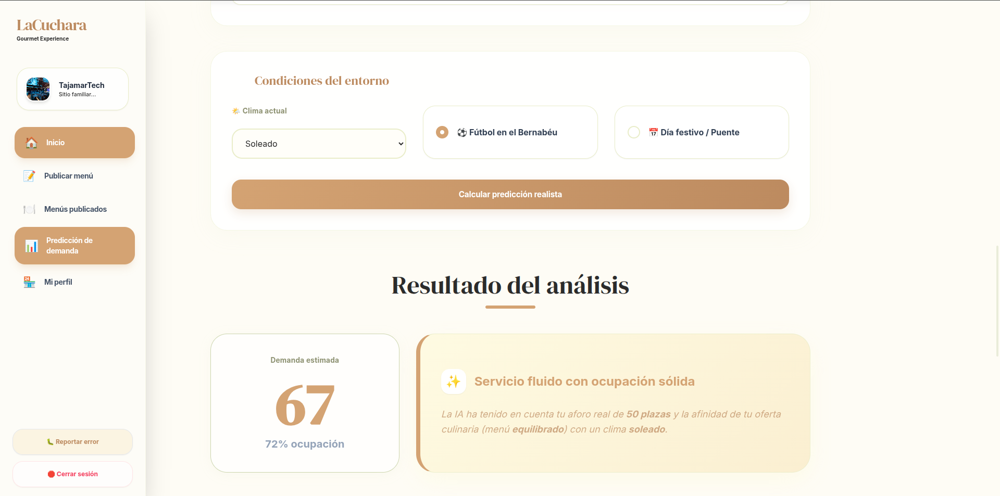
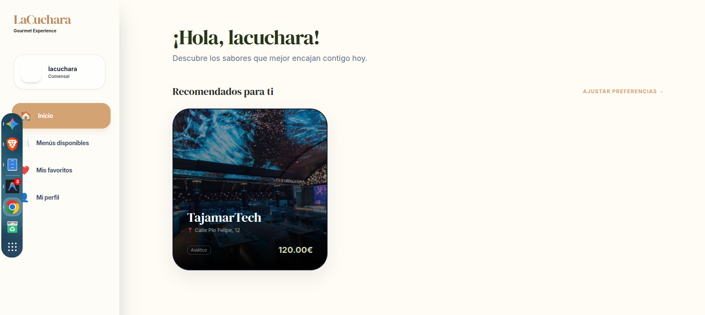
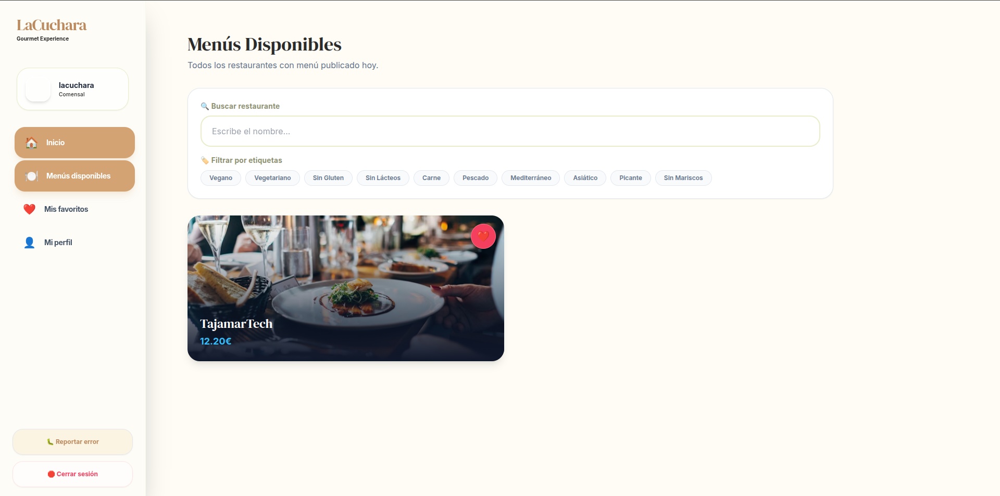

# 🥄 La Cuchara — AI-Powered Hospitality Optimization

### Smart Gastronomy and Demand Forecasting for the AZCA Business District (Madrid)

> **🚀 QUICK VIEW:** You can explore the core logic of the prediction models and data processing here: [**🤖 ai_pipeline/**](./ai_pipeline/)

---

## 📖 About the Project

**La Cuchara** (The Spoon) is an advanced technological solution designed to optimize the dining experience and operational management in the **AZCA business district**.

The project addresses the gap between restaurant supply and office worker demand. By combining **Computer Vision, Natural Language Processing (NLP), and Predictive Analytics**, it aims to drastically reduce food waste (*merma*) while eliminating "menu uncertainty" for thousands of daily workers.

---

## 🔐 Authentication & Identity Management (Firebase)

The platform utilizes **Firebase** to manage a secure, multi-role ecosystem. The system differentiates between two main user types: **Diners** (office workers) and **Restaurant Owners**.

> **Fig 1.** *Login Interface: Custom registration and login flows for both customers and restaurants.*

### Multi-Method Access
We have enabled various authentication providers to ensure a frictionless experience:
*   **Methods:** Email/Password, Google Sign-In, and Phone Authentication.
*   **User Management:** Centralized control via the Firebase Console for real-time monitoring.

| Firebase Configuration | User Management |
| :--- | :--- |
|  |  |
| *Enabled Auth providers.* | *Cloud-based user directory.* |

---

## 🧠 AI Pipeline: Smart Menu Digitization (OCR)

To eliminate manual data entry, we developed a high-precision extraction system using **Azure Document Intelligence**.

> **Fig 2.** *Menu Upload: Restaurants can upload a photo of their physical menu. The system also allows for manual input as a fallback.*

### Entity Extraction & Verification
*   **Automated Reading:** The custom model identifies dishes and prices.
*   **Human-in-the-loop:** Before publishing, owners can review and edit the OCR output to ensure 100% accuracy.

> **Fig 3.** *OCR Output: Structured menu data ready for final review and publication.*

---

## 📈 Demand Forecasting & Analytics

The project features a predictive engine powered by **XGBoost** and **Azure ML**, designed to help chefs plan their inventory.

### 1. Restaurant Insights
Owners have access to a specialized dashboard that uses AI to provide:
*   **Occupancy Predictions:** Based on the specific day of the year.
*   **AI Recommendations:** Smart suggestions for the "Dish of the Day" based on trends.

> **Fig 4.** *Admin View: Real-time status, menu reminders, and AI-driven culinary suggestions.*

### 2. Predictive Models
The system calculates potential demand by crossing the current menu with external factors (weather, events, holidays).

> **Fig 5.** *Demand analysis interface based on the uploaded menu.*

> **Note:** The predictive model is trained on **synthetic data**. While it demonstrates the architectural capability, its real-world precision is limited by the training dataset's simulated nature.

> **Fig 6.** *Occupancy forecasting based on specific environmental conditions.*

---

## 🥗 The Customer Experience (Diner App)

For the office worker, **La Cuchara** acts as a smart concierge for their lunch break.

> **Fig 7.** *Home Screen: Personalized menu recommendations based on the user's dietary profile.*

### Smart Discovery
*   **Dietary Filtering:** Users can filter AZCA's offerings by vegan, gluten-free, or keto preferences.
*   **Live Menus:** Direct access to all published menus in the area with updated pricing.

> **Fig 8.** *Search & Filter: Finding the perfect meal in AZCA based on real-time availability.*

---

## 🛠️ Technologies Used

*   **Frontend:** Next.js 14 (App Router), Tailwind CSS, Framer Motion.
*   **Authentication:** Firebase Auth (Google, Phone, Email).
*   **AI/ML:** Azure Document Intelligence (OCR), Azure OpenAI (GPT-4o-mini), XGBoost.
*   **Data & Backend:** Azure SQL Database, SQLAlchemy, Python 3.9+.
*   **Infrastructure:** Azure AI Foundry / ML Studio.

---
*Project developed as part of the Master's Degree in AI & Big Data by @boorjanunezz & Alejandro Benítez.*
